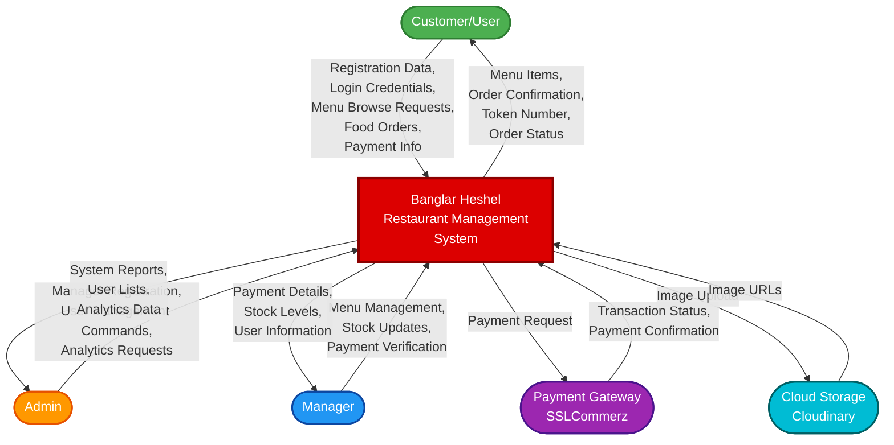
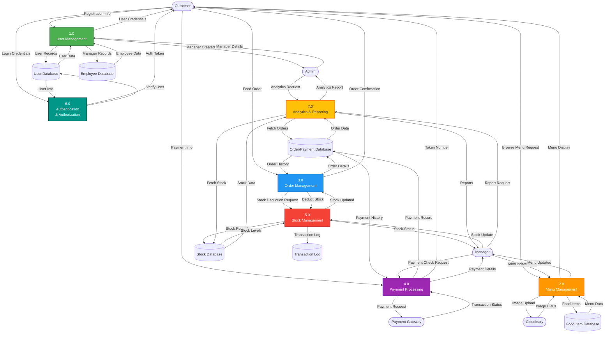
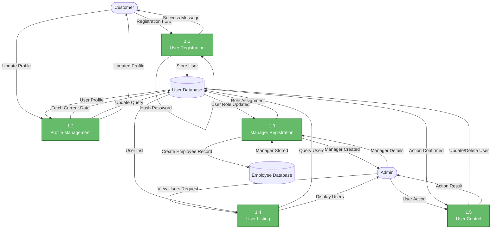
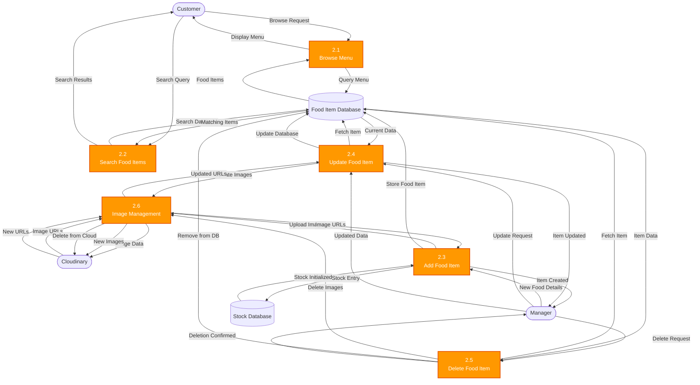
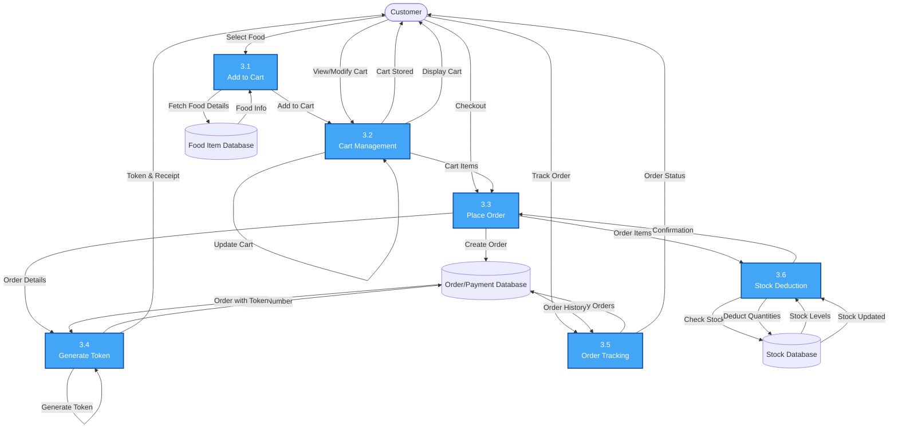
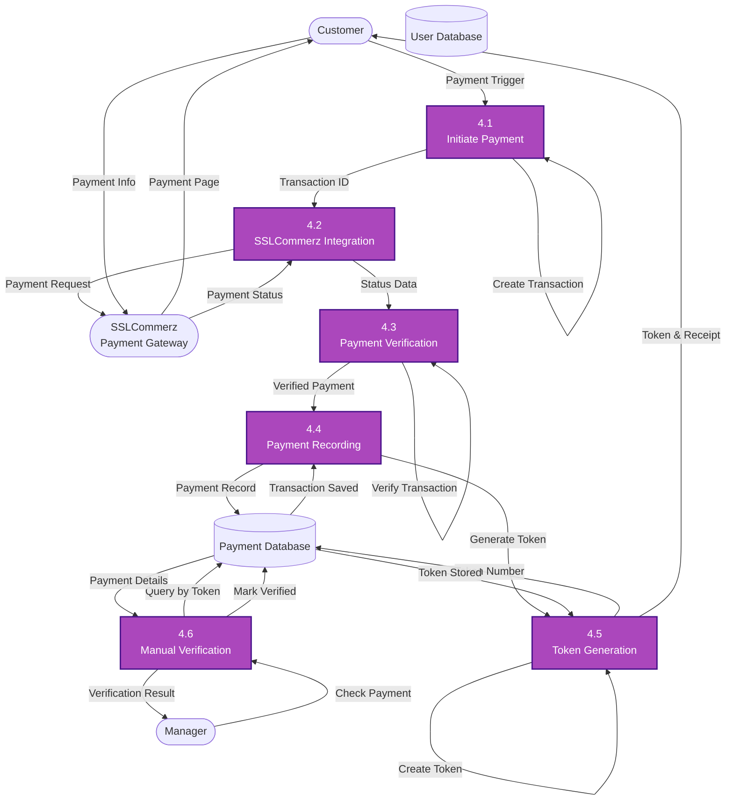
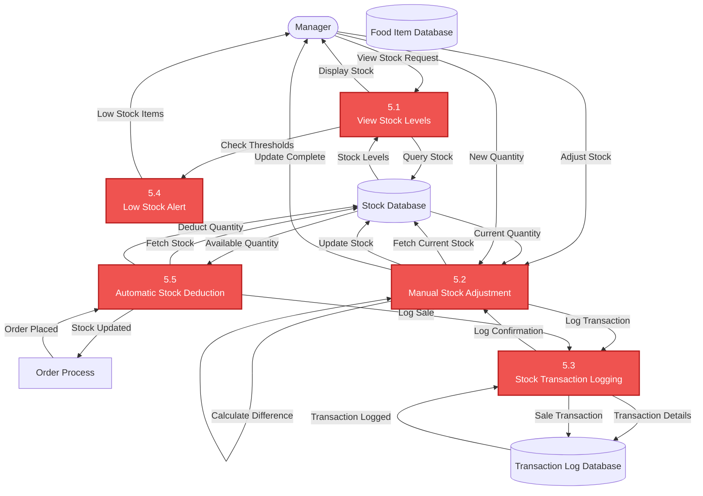
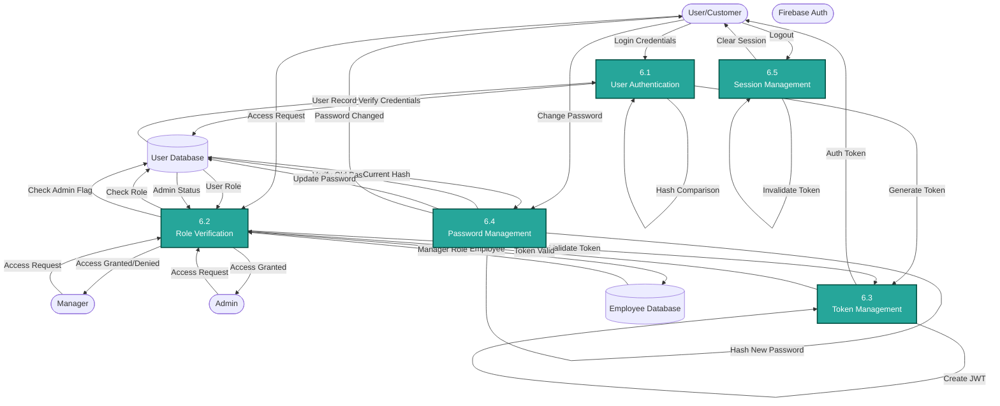
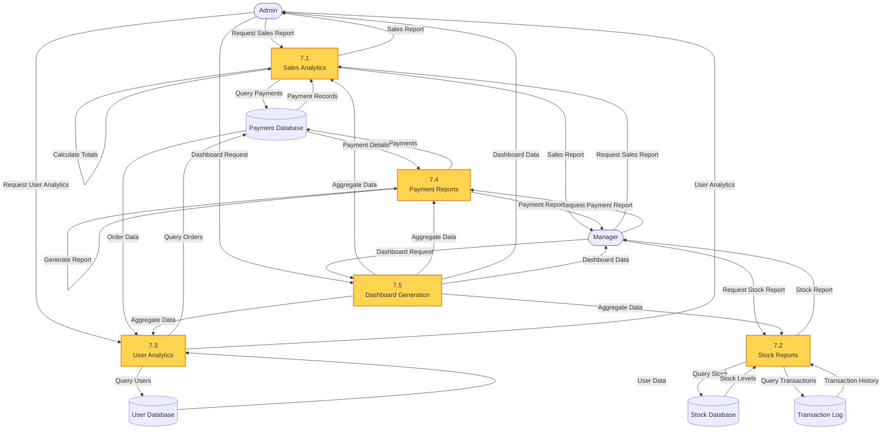
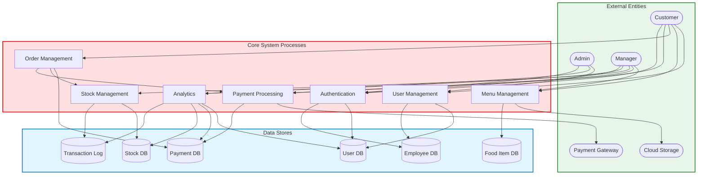

# Banglar Heshel - Restaurant Management System
## Data Flow Diagrams (DFD)

---

## DFD Level 0 - Context Diagram

---

## DFD Level 1 - Main System Processes

---

## DFD Level 2 - Process 1.0: User Management

---

## DFD Level 2 - Process 2.0: Menu Management

---

## DFD Level 2 - Process 3.0: Order Management

---

## DFD Level 2 - Process 4.0: Payment Processing

---

## DFD Level 2 - Process 5.0: Stock Management

---

## DFD Level 2 - Process 6.0: Authentication & Authorization

---

## DFD Level 2 - Process 7.0: Analytics & Reporting

---

## Complete System Overview

---

## Key Data Flows Summary

### 1. User Management Flow
- **Registration**: Customer → Registration Form → Validation → User Database
- **Manager Creation**: Admin → Manager Details → Employee Database + User Role Update
- **User Control**: Admin → User Actions → User Database → Action Confirmation

### 2. Menu Management Flow
- **Browse Menu**: Customer → Menu Request → Food Database → Display Menu
- **Add Food**: Manager → Food Details → Image Upload (Cloudinary) → Food Database + Stock Database
- **Update/Delete**: Manager → Food Actions → Database Update → Confirmation

### 3. Order Management Flow
- **Place Order**: Customer → Cart → Order Creation → Payment Database + Stock Deduction
- **Token Generation**: Order → Token Creation → Token Number → Customer
- **Track Order**: Customer → Order Query → Payment Database → Order Status

### 4. Payment Processing Flow
- **Online Payment**: Customer → Payment Init → SSLCommerz → Transaction Verification → Database
- **Token Pickup**: Customer → Pay Outside → Token Number → Manual Verification by Manager
- **Payment History**: Manager → Query Payment → Database → Payment Details

### 5. Stock Management Flow
- **View Stock**: Manager → Stock Query → Stock Database → Stock Levels
- **Adjust Stock**: Manager → Stock Update → Database → Transaction Log
- **Automatic Deduction**: Order Placed → Stock Check → Deduct Quantity → Update Database
- **Low Stock Alert**: System → Check Thresholds → Alert Manager

### 6. Authentication Flow
- **Login**: User → Credentials → Verify → Generate JWT Token → Access Granted
- **Role Check**: Access Request → Verify Token → Check Role → Allow/Deny
- **Session**: Login → Token → Active Session → Logout → Invalidate

### 7. Analytics Flow
- **Sales Report**: Admin/Manager → Query Payments → Calculate → Report
- **Stock Report**: Manager → Query Stock + Transactions → Generate Report
- **Dashboard**: Admin/Manager → Aggregate All Data → Display Analytics

---

## Database Schema Overview

### Primary Tables
1. **User** - Customer registration, authentication
2. **Employee** - Manager/staff records
3. **FoodItem** - Menu items with details
4. **Stock** - Inventory management
5. **Payment** - Order and payment records
6. **StockTransaction** - Stock movement logs

### Key Relationships
- User → Payment (One-to-Many)
- FoodItem → Stock (One-to-One)
- FoodItem → StockTransaction (One-to-Many)
- Payment → CartItems (Embedded Array)
- Employee → User (Role Assignment)

---

## System Features Highlighted in DFD

### Customer Features
- ✅ Browse menu items
- ✅ Search for specific food
- ✅ Place orders
- ✅ Online payment via SSLCommerz
- ✅ Receive token number
- ✅ Track order history
- ✅ Pay outside and use token

### Admin Features
- ✅ Add and manage managers
- ✅ View all registered users
- ✅ Control user accounts
- ✅ View system analytics
- ✅ Access all reports

### Manager Features
- ✅ View registered users
- ✅ Add/modify/remove menu items
- ✅ Manage food images
- ✅ Update stock levels
- ✅ View payment details
- ✅ Verify token-based payments
- ✅ Generate reports
- ✅ Monitor low stock alerts

---

## Technology Integration Points

### Frontend (React.js + Tailwind CSS)
- User interface for all actors
- Real-time cart management
- Responsive design
- State management (Redux)

### Backend (Node.js + Express.js)
- RESTful API endpoints
- Business logic processing
- Middleware for authentication
- Error handling

### Database (MongoDB)
- NoSQL document storage
- Flexible schema
- Efficient queries
- Data persistence

### External Services
- **SSLCommerz**: Payment gateway integration
- **Cloudinary**: Image storage and management
- **Firebase**: Authentication support (optional)

---

## Legend
- **Squares**: Processes (system functions)
- **Circles**: External entities (users, services)
- **Cylinders**: Data stores (databases)
- **Arrows**: Data flows (information movement)
- **Colors**: Different functional areas

---

## Notes on DFD Levels

### Level 0 (Context Diagram)
- Shows entire system as single process
- All external entities
- High-level data flows
- System boundaries

### Level 1
- Major processes (7 main modules)
- All data stores
- External entity interactions
- Inter-process data flows

### Level 2
- Detailed sub-processes for each major process
- Internal logic and workflows
- Database operations
- Business rules implementation
